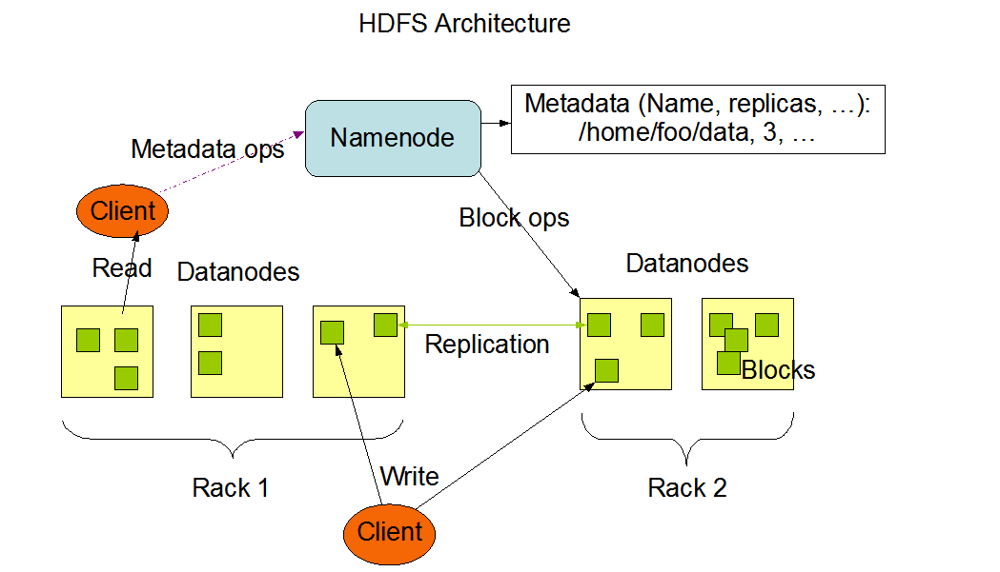
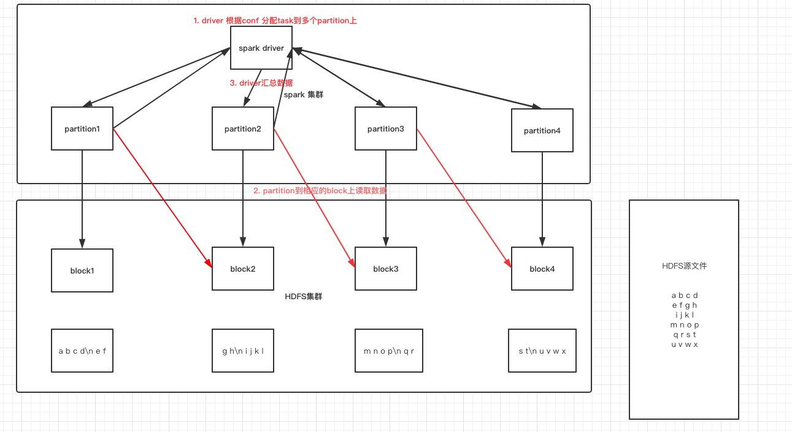
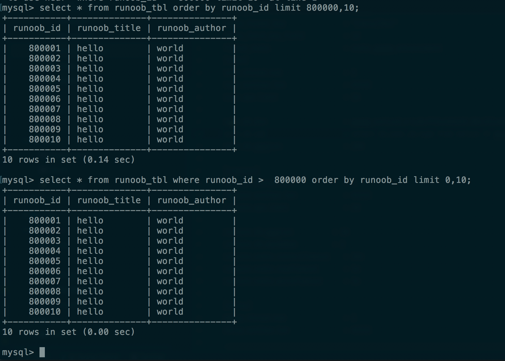
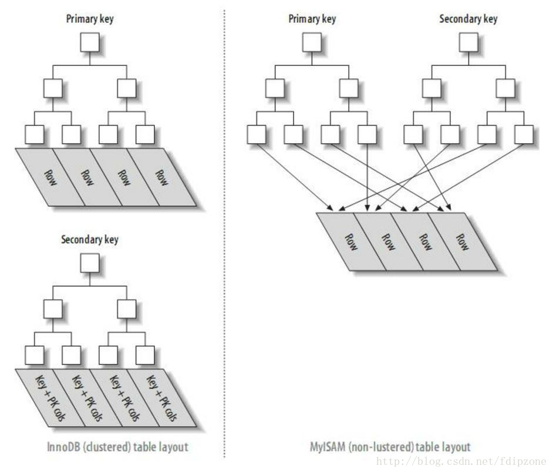
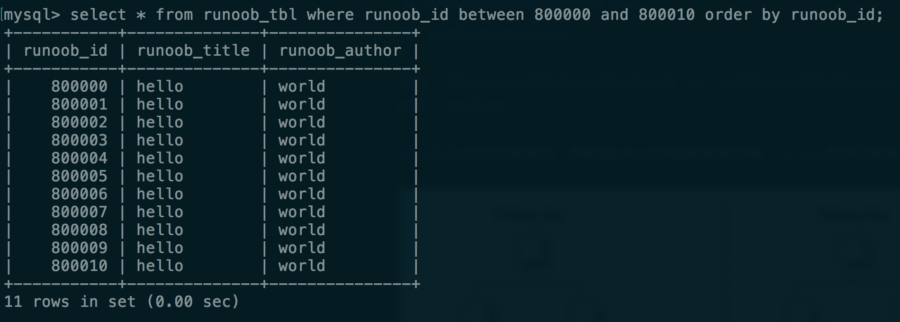
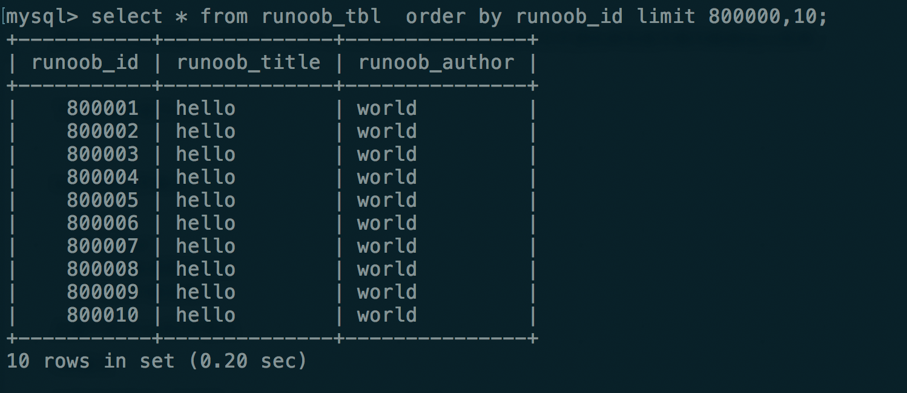
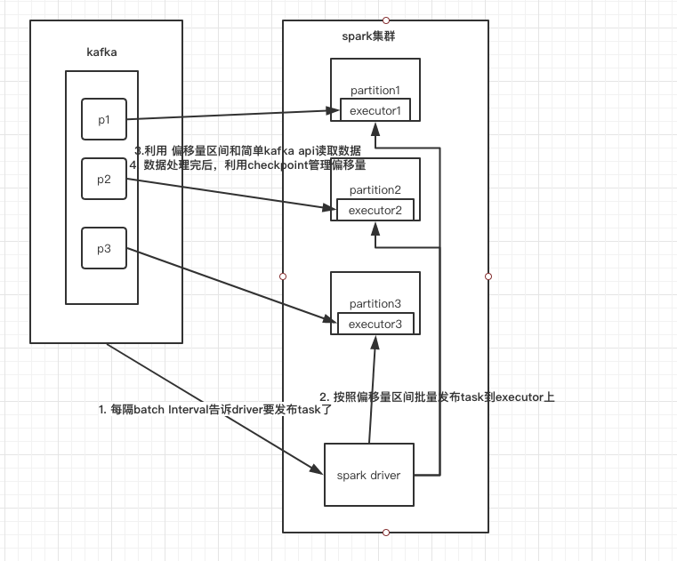
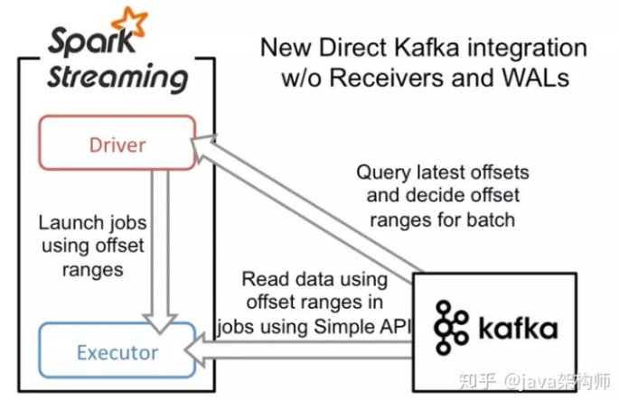

\---

layout: post

title: Spark读取数据的方式

categories: [Spark, 大数据, 技术]

description: some word here

keywords: Spark, stream

\---

# Spark读取数据的方式

## HDFS

### hdfs架构



hdfs把文件按照**字节**切分成多个block，每个block的大小相等。

Namenode：存储元数据

Datanode：包含多个block

### 读取原理



**"断行问题"**：既然无法断定每一个split开始的一行是独立的一行还是被切断的一行的一部分,那就跳过每个split的开始一行(当然要除第一个split之外),从第二行开始读取,然后在到达split的结尾端时总是再多读一行,这样数据既能接续起来又避开了断行带来的麻烦.

## Mysql

使用的是mysql 5.7.26

### 使用limit 的缺陷：

offset过大影响性能:

https://blog.csdn.net/fdipzone/article/details/72793837

```sql
-- 第一时间想到的扫表方式，效率很低
select * from table_name limit 10000,10;
-- 利用索引进行扫描
select * from table_name where id > 10000 limit 0,10;
```



### 分析影响性能原因

因为数据表是InnoDB，根据InnoDB索引的结构，查询过程为：

1. 从数据表中读取第N条数据添加到数据集中
2. 重复第一步直到N= 800000 + 10
3. 根据offset抛弃前面800000 条数
4. 返回剩余的10 条数据

显然，导致这句sql速度慢的问题出现在第二步。前面的80w条数据完全对本次的查询没有意义，却占据了绝大部分的查询时间。如何解决？

核心思想:**先找到数据块，再根据offset的值做偏移处理。 ——> 先执行偏移处理，跳过前面80w条数据，再读取数据块。**



使用between（B+树特性）



只使用order by




## Kafka

direct方式（类似于HDFS）





消费偏移量由spark streaming自己来管理，数据处理成功就更新偏移量，处理失败，就去kafka中重新读取数据，exactly once 的事务支持的比较好。